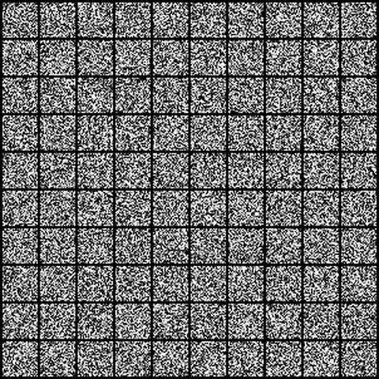
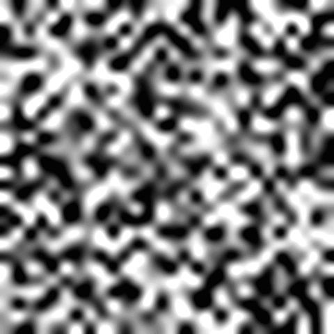

# GravLensDiffusion

## Overview
GravLensDiffusion is a deep learning project that generates high-quality images of Strong Gravitational Lensing using Deep Generative Modeling, specifically Diffusion Models. The project implements a DDPM (Denoising Diffusion Probabilistic Model) following the seminal paper on DDPMs closely, trained on a dataset of 10,000 strong lensing images.

## Implementation Details
* **Model**: Implemented a DDPM (Denoising Diffusion Probabilistic Model)
* **Dataset**: Trained on 10,000 strong lensing images
* **Training**: 40 epochs on Google Colab's free GPU compute
* **Evaluation**: FID (Fréchet Inception Distance) evaluation on 100 generated images
* **Storage**: Project directory hosted on Google Drive

## Results

### Generation Process
The GIF below shows the progression of 100 random noise samples to 100 generated images of Strong Gravitational Lensing over 1000 timesteps:

### Sample Generated Images

    
    

## Performance
* **FID Score**: 27.93 (scores below 20 are generally considered acceptable)
* **Limitations**:
    * Evaluation performed on only 100 generated samples
    * Model trained for only 40 epochs due to GPU restrictions
    * Input images downscaled from 150 to 28 spatial dimensions due to memory constraints

## Future Improvements
* Conduct FID analysis on a larger sample size
* Train the model for more epochs
* Use higher resolution input images
* These improvements are expected to further reduce the FID score

## Acknowledgements
* U-Net model implementation inspired by: [DDPM-Pytorch](https://github.com/explainingai-code/DDPM-Pytorch)
* FID score calculation: [pytorch-fid](https://github.com/mseitzer/pytorch-fid)

## About
GravLensDiffusion is a deep learning model based on DDPM that uses diffusion-based generative techniques to synthesize strong gravitational lensing images. It tackles data scarcity and imbalance, generating high-fidelity images to support astrophysical research and automated classification.
